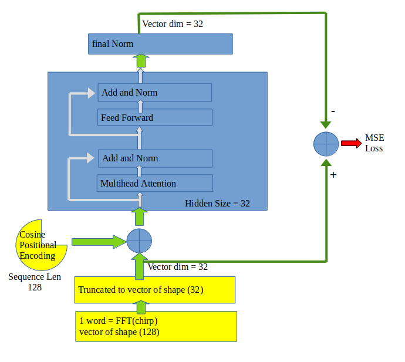

# Infineon Getting Edgy With Machine Learning Contest
## source/main.c

This code is to be compiled in ModusToolbox IDE. After compiling, it is to be loaded onto PSoc6 AI evaluation kit to run. The program runs two tasks simultaneous:
- radar data capture task :  receives radar demodulator output in real-time and forward them to the UDP server task
- UDP server task : periodically broadcast radar data in UDP packets in real time to any UDP client that is currently connected.
The UDP server task is connected to the WIFI Access point whose SSID and passwd are hardcorded here in udp_server.h file:
SSID = getting-edgy
Pass = getting-edgy
To run this code as it is, you may simply configure you smartphone as a wifi hot spot with the above setting, then turn on PSoc6-AI kit, it will automatically search for 'getting-edgy' AP which is your phone and connect to it.

## ubuntu_continuous_training/continousTrainingAndDetection.py
This Python code is to run on a separate ubuntu PC. This PC must connect to the same wifi network as the PSoc6-AI kit.
The Python program connects to PSoc6-AI kit as its UDP client, receives the radar data in real-time, and continuously train a BERT encoder to memorize the activities perceived by the radar.
When unfamiliar input is encountered by the model (training loss spikes), the training code raises the alarm.

## pytorch_saved_model/weight_model.pt
This a pretrained model that the python program starts with. Then every half a day, the training will save a new version of the model overriding the old one.

## Model And Training
The BERT encoder model is defined in the Python code within continousTrainingAndDetection.py.

