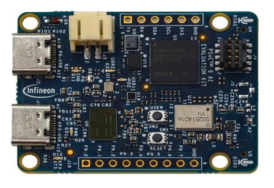

# CY8CKIT-062S2-AI BSP

## Overview

The CY8CKIT-062S2-AI PSOC™ 62S2 AI Evaluation Kit is a a low-cost hardware platform that enables design and debug of PSOC™ 6 MCUs. It comes with Murata LBEE5KL1YN Module, on-board debugger/programmer with KitProg3, microSD card interface,  512-Mb Quad-SPI NOR flash, motion sensor, magnetometer, pressure sensor, PDM-PCM microphone, and RADAR sensor.

To use code from the BSP, simply include a reference to `cybsp.h`.

## Features

### Kit Features:

* Featuring the PSOC™ 6 CY8C62xA MCU (MPN: [CY8C624ABZI-S2D44](https://www.infineon.com/cms/en/product/microcontroller/32-bit-psoc-arm-cortex-microcontroller/psoc-6-32-bit-arm-cortex-m4-mcu/cy8c624abzi-s2d44/)): Ultra low power, high performance MCU based on the dual core CPU architecture of Arm® Cortex®-M4 and Arm® Cortex®-M0+, up to 2 MB of on-chip Flash, 1 MB of SRAM, built-in hardware and software security features, rich analog, digital, and communication peripherals
* Wireless module(Murata 1YN) based on Infineon's AIROC™ CYW43439 single-chip combo device (2.4 GHz Wi-Fi 4 (802.11n) and Bluetooth® 5.2) for evaluating cloud connected applications with PSOC™ 6 as the Wi-Fi host MCU
* Integrated on-board programmer / debugger, memory expansion through 512-Mb Quad-SPI NOR Flash, microSD card interface, LEDs
* Supports PDM-PCM digital microphone, full-Speed USB, an I2C interface.
* Supports barometric pressure sensor (DPS368)
* Supports RADAR sensor (BGT60TR13C)
* Supports 6-axis motion sensor (BMI270)
* Supports magnetometer (BMM350)

### Kit Contents:

* PSOC™ 62S2 AI Evaluation board

## BSP Configuration

The BSP has a few hooks that allow its behavior to be configured. Some of these items are enabled by default while others must be explicitly enabled. Items enabled by default are specified in the bsp.mk file. The items that are enabled can be changed by creating a custom BSP or by editing the application makefile.

Components:
* Device specific category reference (e.g.: CAT1) - This component, enabled by default, pulls in any device specific code for this board.

Defines:
* CYBSP_WIFI_CAPABLE - This define, disabled by default, causes the BSP to initialize the interface to an onboard wireless chip if it has one.
* CY_USING_HAL - This define, enabled by default, specifies that the HAL is intended to be used by the application. This will cause the BSP to include the applicable header file and to initialize the system level drivers.
* CYBSP_CUSTOM_SYSCLK_PM_CALLBACK - This define, disabled by default, causes the BSP to skip registering its default SysClk Power Management callback, if any, and instead to invoke the application-defined function `cybsp_register_custom_sysclk_pm_callback` to register an application-specific callback.

### Clock Configuration

| Clock    | Source    | Output Frequency |
|----------|-----------|------------------|
| FLL      | IMO       | 100.0 MHz        |
| PLL      | IMO       | 48.0 MHz         |
| CLK_HF0  | CLK_PATH0 | 100 MHz          |

### Power Configuration

* System Active Power Mode: LP
* System Idle Power Mode: Deep Sleep
* VDDA Voltage: 3300 mV
* VDDD Voltage: 3300 mV

See the [BSP Setttings][settings] for additional board specific configuration settings.

## API Reference Manual

The CY8CKIT-062S2-AI Board Support Package provides a set of APIs to configure, initialize and use the board resources.

See the [BSP API Reference Manual][api] for the complete list of the provided interfaces.

## More information
* [CY8CKIT-062S2-AI BSP API Reference Manual][api]
* [CY8CKIT-062S2-AI Documentation](https://www.infineon.com/CY8CKIT-062S2-AI)
* [Cypress Semiconductor, an Infineon Technologies Company](http://www.cypress.com)
* [Infineon GitHub](https://github.com/infineon)
* [ModusToolbox™](https://www.cypress.com/products/modustoolbox-software-environment)

[api]: https://infineon.github.io/TARGET_CY8CKIT-062S2-AI/html/modules.html
[settings]: https://infineon.github.io/TARGET_CY8CKIT-062S2-AI/html/md_bsp_settings.html

---
© Cypress Semiconductor Corporation (an Infineon company) or an affiliate of Cypress Semiconductor Corporation, 2019-2025.